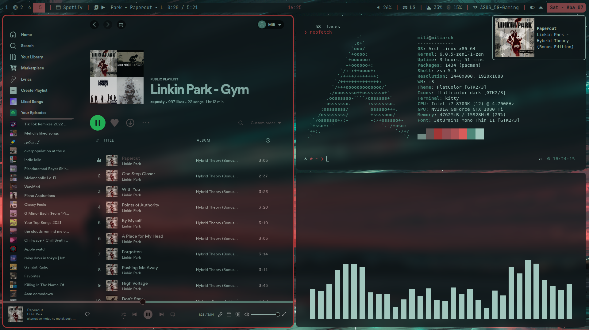

# Mili's dotfiles

## Setup:
+ **Window manager:** i3-gaps
+ **Compositor:** picom-ibhagwanb 
+ **Bar:** Polybar
+ **Shell:** Zsh w/ p10k
+ **Music players:** ncmpcpp + mpd + spotify w/ spicetify
+ **Text editor:** Neovim
+ **Colorscheme:** Pywal + Wpgtk + qt6gtk2 + qt5-styleplugins
+ **Terminal:** Kitty
+ **Application launcher:** Rofi
+ **Notifications:** dunst
+ **Discord:** pywal-discord
+ **Telegram:** wal-telegram

## About Pywal setup
There is a not-so-efficient script in the wal directory called `colorscheme.sh` that gets the wallpaper you want to set. This may update all the necessary colors.

## Screenshots
*Latex setup with vimtex plugin + zathura*
 

*Local music library setup*
 

*Listening to music via Spotify with custom theme and cava music equalizer* 
 

## Thanks to
[Nima Askarian](https://github.com/nimaaskarian) for the inspirations and help.
